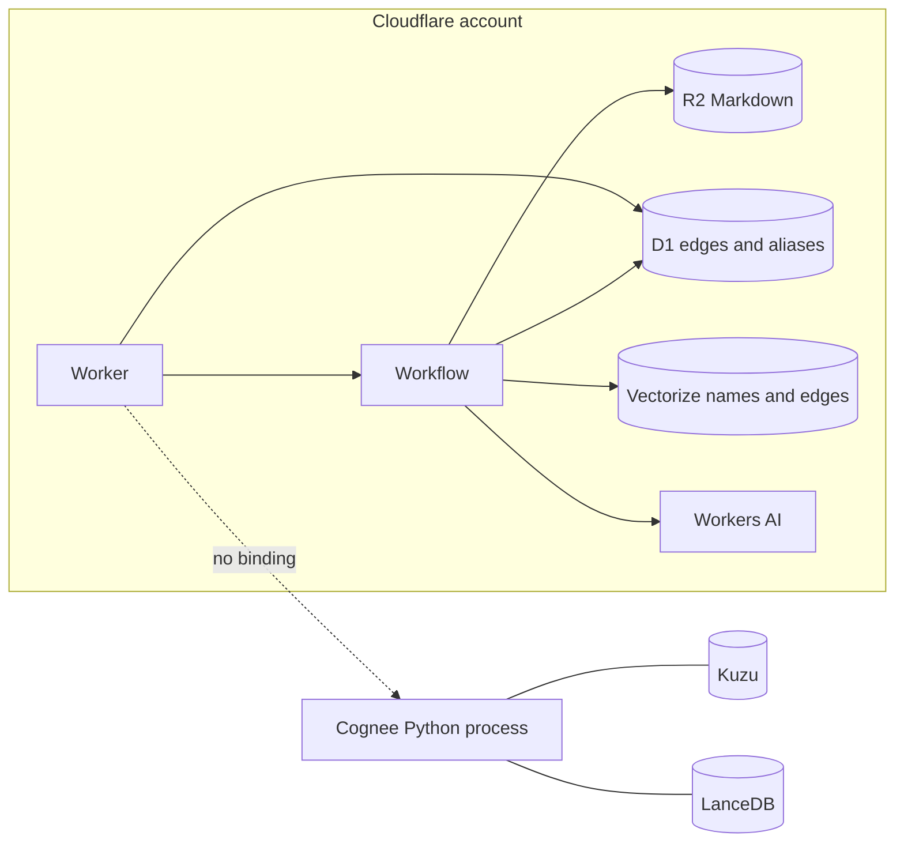
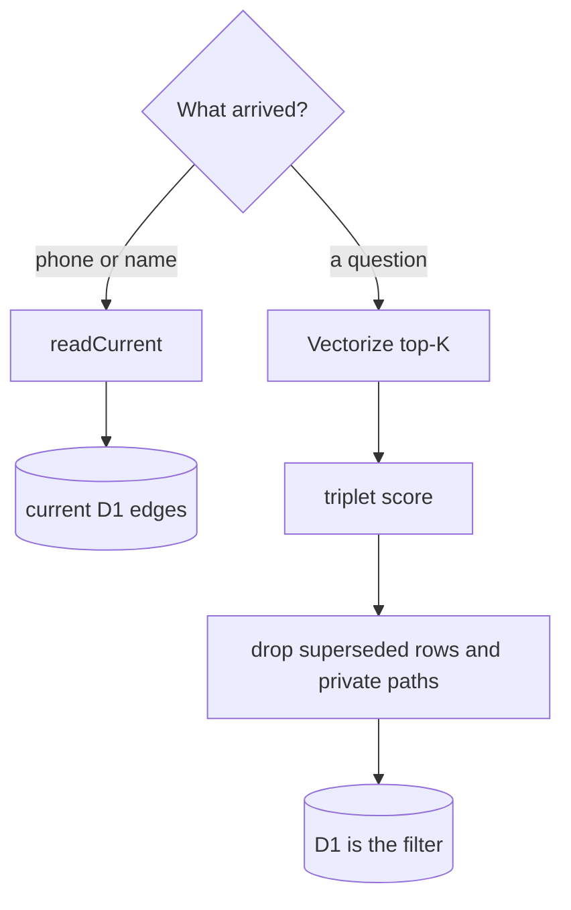
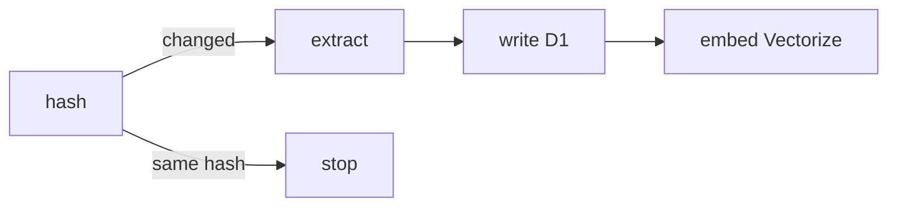

<p align="center">
  
</p>

# cloudnee

Memory for a Cloudflare Worker. Pages stay Markdown. The graph is D1 rows. Search is a vector candidate list plus a score, not a second database engine.

Cloudnee is an independent implementation of five ideas from [Cognee](https://github.com/topoteretes/cognee) 1.6.0: a stable entity id, one extraction per chunk, triplet ranking, a feedback average, and a permission check. Cognee stores those in Kuzu, LanceDB, and a Python process. Those engines do not run on Workers. The ideas do.

```
remember(page)  →  Workflow: hash, extract, write, embed
readCurrent     →  D1, by phone or name, immediately
recall(query)   →  Vectorize top-K, then the triplet score, then D1 filters
improve(edges)  →  queue a 1–5 rating; cron applies old + alpha × (rating − old)
```

The picture version is [`docs/fit.html`](docs/fit.html).



A known phone reads D1 and stops. An open question takes the long way, then D1 still has the last word.





## How a Cognee mechanism sits on Cloudflare

| Cognee | cloudnee |
| --- | --- |
| `Entity:<name>` | Primary key `(org_id, normalized_name)`. A phone is an alias row written in the same request. Punctuation-stripped names merge on their own. A phone number does not. |
| One extraction call per chunk | A Workflow step. The model call is a network wait. |
| Chunk summary | Not built. Page search is a separate job from the graph. |
| Node and edge embeddings | Two Vectorize indexes, `entity-name` and `edge-text`, metadata `orgId`. |
| The graph | D1 `edges`: org, source, relation, target, path, `superseded_by`, `feedback_weight`. |
| Supersede `lives_in` and `quoted_price` | SQL in the write step. The newest row stays current. The older row keeps `superseded_by`. |
| Contradiction pass | Off. The column is there for a later step. |
| Triplet ranking | Vectorize top-K, then `sum` of the three distances. Each distance is multiplied by `(2 − importance)`. Feedback blends only when you set `feedbackInfluence` above 0, which is also Cognee's default-off switch. |
| Feedback average | Edge ids from the prompt. `old + alpha × (rating − old)`, alpha `0.1`, implicit ratings use half alpha. |
| Dataset permissions | `org_id` on every row. `audience: "public"` drops paths under `customers/`. |
| This chat's "she" | Not here. The chat Durable Object already has the thread. |
| HVAC is a kind of aircon | An ontology alias row. |
| Durable pipeline | Hash the note, skip when unchanged, extract, write, embed. |

Default importance is `0.5`. Default feedback weight is `0.5`. A missing vector distance uses penalty `6.5`, and that penalty is not blended with feedback. The top of the list is the smallest score. Default recall returns 5 triplets.

## Nine jobs

The benchmark is the CoolAir desk: Mrs Tan, Rahman, and Koh. It runs on Node's built-in SQLite, which speaks the same SQL as D1, and an in-process vector index that can hide new points for 60 seconds the way a fresh Vectorize upsert can lag.

```bash
npm test
npm run bench
```

This run is local. Node's SQLite stands in for D1, and an in-process index stands in for Vectorize, including a 60-second hide on fresh points. It is not a timed call against a deployed Worker.

<!-- BENCH -->

| Job | Time | Result |
| --- | ---: | --- |
| Four words still open her file | 7.75 ms | Phone `6591234567` opens the baby rule from D1 |
| Two filenames, one person | 1.41 ms | The phone alias sees both pages |
| HVAC finds the aircon page | 1.43 ms | Ontology alias `hvac` → `aircon` |
| East + mornings + open visit | 2.26 ms | Top covered entity is `mrstan` |
| The old price stays, the answer says 160 | 1.39 ms | `180` kept as `superseded_by`, recall says `160` |
| A used rule outranks an unused one | 1.14 ms | Baby score 1.35 ranks ahead of smell 1.5 |
| An edited page is the next read | 0.92 ms | Next D1 read is Bedok South |
| The other chat sees 160 before Vectorize does | 1.08 ms | D1 is current while the vector point is still lagged |
| The website does not receive her file | 0.94 ms | Public recall has the service page only |

9 jobs passed. `npm test` is 22 tests, 0 failures.

<!-- /BENCH -->

## Local library

```ts
import { MemoryVectorIndex, SqlGraphStore, TokenEmbedder, openSqlite, remember, readCurrent } from "cloudnee";

const opened = openSqlite();
const deps = {
  store: new SqlGraphStore(opened.db),
  vectors: new MemoryVectorIndex(),
  embedder: new TokenEmbedder(),
  extractor: { async extract(text: string) { return JSON.parse(text); } },
};

await remember(deps, {
  orgId: "coolair",
  path: "customers/6591234567.md",
  markdown: JSON.stringify({
    entities: [{ name: "Mrs Tan", type: "Person" }],
    edges: [{ source: "Mrs Tan", relation: "has_rule", target: "baby" }],
  }),
  links: [{ alias: "6591234567", name: "Mrs Tan", kind: "phone" }],
});

await readCurrent(deps.store, "coolair", "6591234567");
```

`TokenEmbedder` is a deterministic stand-in so the tests run without Workers AI. The benchmark (`bench/jobs.ts`) uses a fixed vocabulary embedder so the nine jobs do not depend on hash collisions. Production passes Workers AI embeddings from `@cf/baai/bge-small-en-v1.5` (384 dimensions, cosine).

## Worker

`wrangler.jsonc` binds D1, two Vectorize indexes, Workers AI, R2, a Workflow, and an hourly cron that flushes the feedback queue.

```bash
wrangler d1 create cloudnee
wrangler vectorize create cloudnee-entity-name --dimensions=384 --metric=cosine
wrangler vectorize create cloudnee-edge-text --dimensions=384 --metric=cosine
wrangler r2 bucket create cloudnee-notes
wrangler d1 execute cloudnee --file=migrations/0001_init.sql
```

`POST /v1/remember` starts the cognify workflow. `POST /v1/recall` ranks triplets. `GET /v1/current` reads D1 by phone or name and does not wait for the vector index. Set `CLOUDNEE_TOKEN` and send `Authorization: Bearer …` before exposing it.

The Markdown written to R2 is the file a person edits. The next `remember` hashes it and, when the hash changed, rebuilds only that page's edges.

## What this is not

No Kuzu, no LanceDB, no Python process, no contradiction detector, no code graph. Entity merge is normalized-name equality, or cosine at least `0.85` on the name vectors when the types match. A phone becomes the same person only when the caller writes the alias.

## License

Apache-2.0. Copyright 2026 LintLabs. See `NOTICE` for the Cognee formula credit. Cloudnee is not affiliated with Topoteretes or Cloudflare.
